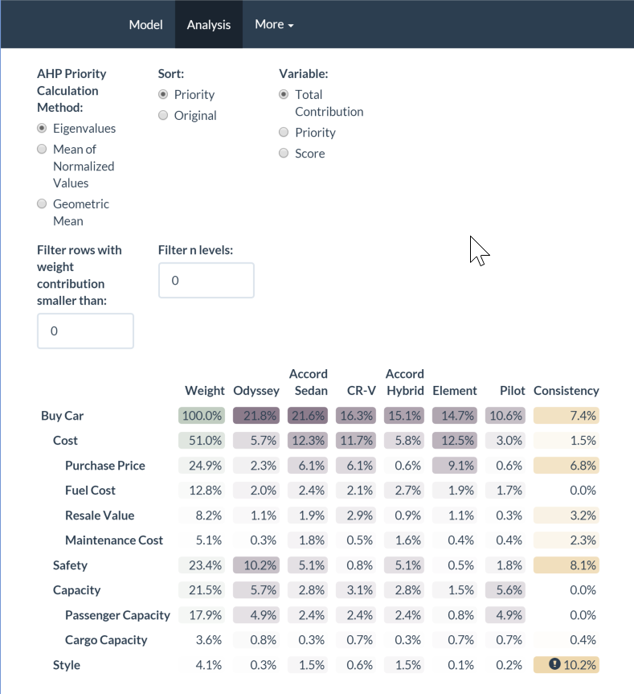

# Badges

## Master

[](https://travis-ci.org/gluc/ahp)
[](https://ci.appveyor.com/project/gluc/ahp)
[](http://codecov.io/github/gluc/ahp?branch=master)
[](http://cran.rstudio.com/web/packages/ahp)

## Dev

[](https://travis-ci.org/gluc/ahp)
[](https://ci.appveyor.com/project/gluc/ahp)
[](http://codecov.io/github/gluc/ahp?branch=dev)

# About this Package

An R package to model complex decision making problems using AHP (Analytic Hierarchy Process).

The basic workflow with this package is:

1. specify your ahp problem in an ahp file
2. load ahp file, using `LoadFile`
3. calculate model, using `Calculate`
4. output model analysis, either using `GetDataFrame` or using `ShowTable`
 
For more information, see the package vignette using `vignette("AHP car example")`

There is also a Shiny app that complements that package. You can try it out at http://ipub.com/apps/ahp/

# Example

```{code = R} 

devtools::install_github("gluc/ahp", build_vignettes = TRUE)
vignette("car-example", package = "ahp")
vignette("multiple-decisionmakers", package = "ahp")

# run analysis
library(ahp)
ahpFile <- system.file("extdata", "car.ahp", package="ahp")
carAhp <- Load(ahpFile)
Calculate(carAhp)
Visualize(carAhp)
Analyze(carAhp)
AnalyzeTable(carAhp)

# looking at the vacation example, a multi-decision-maker model
ahpFile <- system.file("extdata", "vacation.ahp", package="ahp")
vacationAhp <- Load(ahpFile)
Calculate(vacationAhp)
Analyze(vacationAhp, decisionMaker = "Dad")
AnalyzeTable(vacationAhp, decisionMaker = "Mom")
AnalyzeTable(vacationAhp)
```

To play around with the package, you may want to run the Shiny GUI that comes with the package:

```
RunGUI()
```




To play around with the example files in your dev environment, you may want to copy them out of the lib path, e.g. like so:

```
# On Windows
file.copy(ahpFile, "C:\\tmp")

# Or, on Linux:
file.copy(ahpFile, "~")

```

Then, open them in the text editor of your choice, and modify them. To run the analysis, do, for instance:

```
myVacation <- LoadFile("C:\\tmp\\vacation.ahp")
```

# NOTE:
The latest from github dev branch may have some breaking changes compared to CRAN. See [NEWS](https://github.com/gluc/ahp/blob/dev/NEWS) for details.

# Getting Started

# Conventions

Coding Conventions: Google Style Guide, see https://google-styleguide.googlecode.com/svn/trunk/Rguide.xml

Versioning Conventions: SemanticVersioning. See http://semver.org/ for details

Branching Conventions: GitFlow. See https://www.atlassian.com/git/tutorials/comparing-workflows/gitflow-workflow

Pull Requests: Very welcome. Please branch from dev.
