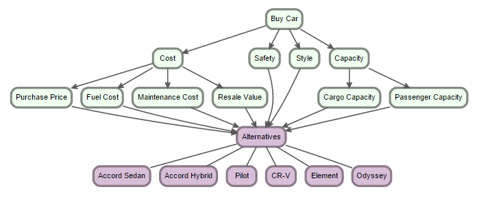
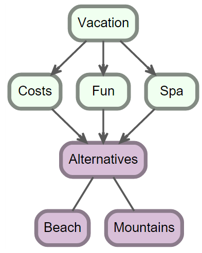

```{r set-options, echo=FALSE, cache=FALSE}
options(width=120)
#opts_chunk$set(comment = "", warning = FALSE, message = FALSE, echo = TRUE, tidy = FALSE, size="small")
#read_chunk("some/script/I/want/to/load.R")
```


## Introduction

### What is AHP?

AHP is a method allowing individuals or groups to make complex decisions. The core concept of AHP is that alternatives are always compared pairwise (and not, say, by giving a score, or sorting alternatives). AHP is used in many fields, from finance to criminal investigation.

For a general introduction to AHP, you might be interested in [this](http://en.wikipedia.org/wiki/Analytic_hierarchy_process).

Another good introduction is [here](http://bpmsg.com/ahp-introduction/)

For a more formal introduction to the subject, see: Saaty, T. L. (2001). Decision Making for Leaders: The Analytic Hierarchy Process for Decisions in a Complex World, New Edition 2001 (3 Revised). Pittsburgh, PA: RWS Publications.

### About this Package

This package is built on top of the data.tree package, and uses `R6` reference classes. To learn more about these, you might be interested in the Introduction:

```{r, eval = FALSE}
library(R6)
vignette('Introduction', package = 'R6')
```


Even though this is not required, the data.tree Introduction vignette might also be helpful:

```{r, eval = FALSE}
library(data.tree)
vignette(package = 'data.tree')
```

## Car Example

This vignette follows a well-known AHP example that you can also find e.g. on [Wikipedia](http://en.wikipedia.org/wiki/Analytic_hierarchy_process_%E2%80%94_Car_example). In this example, the Jones family wants to buy a new car and uses AHP to decide systematically which car they should buy. Even though a few details are different from the original article, it is recommended to consider this vignette as an extension of that article, and not as a self sufficient document.

When deciding which car to buy, the family considers the following criteria: cost, safety, style, and capacity. Additionally, some of the criteria have sub-criteria. 

The Jones' have a shortlist of 6 cars.

We can draw the hierarchy like this:


### Model Specification

Using the ahp package, the AHP hierarchy tree can be defined in an ahp file. An ahp file is a text file in yaml format, following a few conventions. For example:

```{r, echo=FALSE}
ahpFile <- system.file("extdata", "car.ahp", package="ahp")
cat(readChar(ahpFile, file.info(ahpFile)$size))
```

Let's look at the various elements of this file.

#### Alternatives

The first section is a list of alternatives. Note that they have properties. For example: 

```
Alternatives: &alternatives
              Accord Sedan:
                price: 20360
                mpg: 31
                passengers: 5
                cargo: 14
                curb weight: 3289
                safety class: Midsize Car
                crash rating: 4 in Side Impact Front
                residual value: 0.52
              Accord Hybrid:
                price: 31090
                mpg: 35
                passengers: 5
                ...
```

You are entirely free regarding the type and format of information you store in your alternatives. Some models can do without any properties at all. However, often you would like to define your preferences as a function of properties. Later, you will see how you can define functions that refer to these properties to derive the pairwise preferences of alternatives with respect to a specific criteria. 

#### Goal

The second section of the ahp file is the *Goal*. Here, you define your criteria tree, your pairwise preferences, and - if applicable - your preference functions.

##### Criteria

Criteria are grouped hierarchically. Each criteria has at least the following sections:

1. a name of the criteria (e.g. Cost)
2. the preferences, either 
    + pairwise preferences, or
    + a preferenceFunction
3. its sub-criteria (e.g. Maintenance Cost) or alternatives, as we'll see in the next section

An example of a criteria which has explicit pairwise preference is the 

```
Cost:
  preferences:
    pairwise:
      - [Purchase Price, Fuel Cost, 2]
      - [Purchase Price, Maintenance Cost, 5]
      - [Purchase Price, Resale Value, 3]
      - [Fuel Cost, Maintenance Cost, 2]
      - [Fuel Cost, Resale Value, 2]
      - [Maintenance Cost, Resale Value, 1/2]
  children:
    Purchase Price:
      preferences: 
      ...
```

Here, we say, for instance, that Purchase Price is slightly more important to Fuel Cost. Purchase Price is, however, much more important than maintenance cost.

##### Alternatives

To keep the ahp file short, you can reference to the alternatives defined above. In order for this to work, your alternatives need to be defined as an anchor, using the & sign:

```
Alternatives: &alternatives
              Accord Sedan:
                price: 20360
                ...
```

Note that this is a standard YAML feature.

You can then later refer to the anchor using the * reference feature:

```
Style: 
  preferences: 
    pairwise:
      - [Accord Sedan, Accord Hybrid, 1]
      - [Accord Sedan, Pilot, 7]
      - [Accord Sedan, CR-V, 5]
      - [Accord Sedan, Element, 9]
      - [Accord Sedan, Odyssey, 6]
      - [Accord Hybrid, Pilot, 7]
      - [Accord Hybrid, CR-V, 5]
      - [Accord Hybrid, Element, 9]
      - [Accord Hybrid, Odyssey, 6]
      - [Pilot, CR-V, 1/6]
      - [Pilot, Element, 3]
      - [Pilot, Odyssey, 1/3]
      - [CR-V, Element, 7]
      - [CR-V, Odyssey, 5]
      - [Element, Odyssey, 1/5]
  children: *alternatives
```

#### Preference Function

Instead of defining the preferences explicitly in a pairwise manner, you can define a preference function. For example, you can define

```
Fuel Cost:
  preferences: 
    function:
      function(a1, a2) min(9, max(1/9, a1$mpg/a2$mpg))
  children: *alternatives
  ...
```

Note that, in this case, we have a field *preferenceFunction* instead of *preferences*. The function itself is a standard R function, and the arguments a1 and a2 are pairwise combinations of the criteria, i.e. in this case, the alternatives. 

Here, we simply say that the AHP preference is the ratio of the mpg (i.e. miles per gallon) a car uses. And since we store properties mpg on the alternatives, we can reference them directly here. We want the ratio to be between 1/9 and 9, as these are the typical AHP acceptable preferences.

You can even define a named preference function that you can use for recursion:

```
Resale Value:
  preferences:
    function: >
      GetResalePreference <- function(a1, a2) {
        if (a1$`residual value` < a2$`residual value`) return (1/GetResalePreference(a2, a1))
        ratio <- a1$`residual value` / a2$`residual value`
        if (ratio < 1.05) return (1)
        if (ratio < 1.1) return (2)
        if (ratio < 1.15) return (3)
        if (ratio < 1.2) return (4)
        if (ratio < 1.25) return (5)
        return (5)
      }
    children: *alternatives 
```

### Load

Loading the file is done by calling `LoadFile`:

```{r}
library(ahp)
ahpFile <- system.file("extdata", "car.ahp", package="ahp")
carAhp <- Load(ahpFile)
```


`carAhp`, the return value of `LoadFile`, is a `data.tree` structure. Its structure is the same as the one of the file. If you are interested in solving AHP problems programmatically, all you need to do is to create a tree with that structure, using the `data.tree` functions.

```{r}
library(data.tree)
print(carAhp, filterFun = isNotLeaf)
```

### Calculate

```{r}
Calculate(carAhp)
print(carAhp, priority = function(x) x$parent$priority["Total", x$name])
```

Don't worry if you don't understand this command. But if you are interested you might want to look into the structure of carAhp, and read up on `data.tree` documentation.

### Visualize

```{r, eval = FALSE}
Visualize(carAhp)
```

 


### Analyze

```{r}

Analyze(carAhp)

```
Note that, thanks to the `formattable` package, the columns are `numerics`, even though they are formatted as percentages.

Another way to display the AHP analysis is with the `ShowTable` function, which displays an html table with color codings to help interpret the numbers:

```{r}
AnalyzeTable(carAhp)
```

Finally, note that the `Analyze` and `AnalyzeTable` functions have many more options, e.g. to sort, filter, and further customize the output. For example:

```{r}
AnalyzeTable(carAhp, 
             variable = "priority", 
             sort = "orig",
             pruneFun = function(node, decisionMaker) PruneByCutoff(node, decisionMaker, 0.05),
             weightColor = "skyblue",
             consistencyColor = "red",
             alternativeColor = "green")
```


## Vacation Example (Multiple Decision Makers)

The `ahp` package also supports multiple decision makers, as shown by the vacation example, provided with the `ahp` package.
The basic idea is that multiple people get to formulate their pairwise preferences, and then the AHP calculates the average. Often, each decision maker has the same voting weight, but that does not need to be the case. 

In this example we look at a family that wants to decide where to go on vacation. There are two options: to the mountains, or to the beach. The family has already found a suitable hotel at each destination, and has calculated to total price of each destination. All three family members can vote on the destination, but mom and dad have twice the voting power of the kid.

### Model Specification

The file is provided by the `ahp` package, and you may look at its content as so:

```{r, comment = NA}
ahpFile <- system.file("extdata", "vacation.ahp", package="ahp")
cat(readChar(ahpFile, file.info(ahpFile)$size))
```

The file structure is similar to the `car.ahp` file. There are two main differences, however:

* there is a `decision-maker` section
* for each `preferences` section, there are sub-nodes, one for each decision maker

#### The `decision-maker` section

In our example, this section is directly below the Goal:

```
  decision-makers:
    #optional node, needed only if not all decision-makers have equal voting power
    - Dad: 0.4
    - Mom: 2/5
    - Kid: 0.2
```

The node contains a map of decision makers, together with their respective weights. As the commentary says, this section is optional, and only required if you do not have equal voting power.

Additionally, there may be more than a single `decision-makers` section. If, for example, Dad has more voting power on the Cost criteria, and Mom more on the Spa, then you can add multiple `decision-makers` nodes. These weights are *inherited*, i.e. each criteria node checks if it has a `decision-makers` directive. If it doesn't, it walks toward the root and checks on each ancestor. If it cannot find a directive, even at the root, it assumes equal voting power.

#### The `preferences` section

In the case of multiple decision makers, the preferences look like this:

```
  preferences:
    Dad:
      pairwise:
      - [Costs, Fun, 4]
      - [Costs, Spa, 9]
      - [Fun, Spa, 4]
    Mom:
      pairwise:
      - [Costs, Fun, 1/4]
      - [Costs, Spa, 1/9]
      - [Fun, Spa, 1/5]
    Kid:
      pairwise:
      - [Costs, Fun, 1/9]
      - [Costs, Spa, 1]
      - [Fun, Spa, 9]
```

Note, however, that different decision-makers can have different types of preferences, for instance:

```
    Costs:
      preferences:
        Dad:
          function: 
            function(a1, a2) min(9, max(1/9, a2$cost/a1$cost))
        Mom:
          pairwise:
            - [Beach, Mountains, 1/3]
        Kid:
          weight:
            - Beach: 1/2
            - Mountains: 0.5
      children: *alternatives
    
```

Here, Dad says that if alternative 1 has half the cost of alternative 2, it is twice as preferred. Mom wants to keep it simple and says that, cost-wise, whe prefers the mountains over the beach. The kid, finally, has not yet fully grasped the concept of money, so he simply gives a 0.5 weight to each alternative, essentially saying he's indifferent.

### Load and Calculate

To make the full analysis, averaging the decision-makers' preferences, you use the same functions as for the single decision-maker case:

```{r}
ahpFile <- system.file("extdata", "vacation.ahp", package="ahp")
vacationAhp <- Load(ahpFile)
Calculate(vacationAhp)

```


### Visualize

```{r, eval = FALSE}
Visualize(vacationAhp)
```

 

### Analyze

#### Total

```{r}
AnalyzeTable(vacationAhp)
```

However, you may also drill down into each decision maker.

#### Dad

```{r}
AnalyzeTable(vacationAhp, decisionMaker = "Dad")
```

#### Mom

```{r}
AnalyzeTable(vacationAhp, decisionMaker = "Mom")
```


#### Kid

```{r}
AnalyzeTable(vacationAhp, decisionMaker = "Kid")
```

