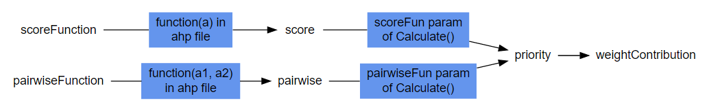

```{r set-options, echo=FALSE, cache=FALSE}
options(width=120)
#opts_chunk$set(comment = "", warning = FALSE, message = FALSE, echo = TRUE, tidy = FALSE, size="small")
#read_chunk("some/script/I/want/to/load.R")
```


ahp File version: 2.0

## Introduction

This vignette describes the details of the ahp file format, as well as the basics of the `Calculate` process. Read this if you want to understand how to specify your AHP problem in an ahp file.

## Basics

### YAML

The ahp files are in YAML format. You will find more information about YAML on [Wikipedia](https://en.wikipedia.org/wiki/YAML). 


The most important points/traps are:

1. YAML is based on *indentation*
2. Comment lines are beginning with #
3. Multiple lines indicated by >
4. Anchors and references indicated by & and *, respectively

### ahp File Format Elements

In a nutshell, an ahp file consists of the following stylized elements:

```
Version
Alternatives
  alternative 1
    property 1 (optional)
    property 2 (o)
    ...
  alternative 2
    property 1 (o)
    property 2 (o)
  ...
Goal
  decision-makers (o)
  preferences
    decision maker 1 (o)
      scoreFunction or
      score or
      pairwiseFunction or
      pairwise or
      priority
    decision maker 2
      ...
  children
    criteria 1
      preferences
      childrend
        sub-criteria 1.1
        sub-criteria 1.2
          children: *alternatives
      ...
    criteria 2
      ...

```

## Version

Each ahp file must have a version, so that the parser can ensure backward compatibility. The version is of the format major.minor, e.g. 2.1 
Major versions indicate non-backward compatibile changes, whereas a minor upgrade is backward compatible. For example, every 2.1 file is also conforming to the 2.2 specification.

The version number is not in line with the ahp package number.

Early ahp files did not require a version, but now the parser expects a version to be present. So, to be able to process a file that was compatible with version 0.1.1 of the ahp package, you first need to add the following line at the top of the file:

```
Version: 1.0
```

## Alternatives

Thanks to the YAML anchoring feature, alternatives can be defined once, in a separate section. Later, you will see how to reference this anchor. 

You can also add any custom property to each alternative. Later, you will see how you can refer to this data in the `scoreFunction` and `pairwiseFunction` attributes.

A typical alternatives section might look like this:

```
Alternatives: &alternatives
  Beach:
    cost: 10000
  Mountains:
    cost: 5000
```

## Goal

The goal section describes your tree of AHP criteria and alternatives. For example:

```
Goal:
  name: Vacation
```

This is the only node that has a `name`, the criteria, subcriteria and alternatives are named implicitly.

If you want, you can also add other properties, except the reserved names (such as `preferences`, `children`, `weightContribution`, and others). For example:

```
Goal:
  name: Vacation
  description: |
    A family wants to go on vacation,
    but cannot decide where about.
```
These attributes can make your model more expressive, and they are displayed as tool tip when using the `Visualize` function.

### Hierarchy

The `Goal` constitutes the root of a criteria tree. Typically, you nest multiple levels of criteria into a hierarchy. For this, you use the `children` element, like so: 


```
Goal:
  name: Vacation
  children:
    Costs:
    Fun:
    Spa:
```
Note that you can have more than 2 levels, and branches do not need to have the same depth. For example:

```
Goal:
  name: Projects
  children:
    Costs:
      children:
        Development:
        Maintenance:
    Risk:
    Opportunities:
```

Again, you can add other attributes which will be shown as tool tips in the `Visualize` function.

#### Alternatives

On the leaf criteria, you add the alternatives, using the YAML reference feature:

```
Goal:
  name: Vacation
  children:
    Costs:
      children: *alternatives
    Fun:
      children: *alternatives
    Spa:
      children: *alternatives
```

### Decision Makers

If you have multiple decision makers in your AHP model, and if decision makers have unequal voting rights, your goal needs a `decision-maker` section. Otherwise, leave this out.

The `decision-maker` section defines the weight of the voting right of each decision maker. For example:

```
Goal:
  name: Vacation
  decision-makers:
    - Dad: 0.4
    - Mom: 2/5
    - Kid: 0.2
```
Note that you can use R expressions that evaluate to a numeric, as in Mom's case above. The weights of the decision-makers must sum to 1.

If you have multiple decision-makers, but no `decision-makers` section, then equal voting power is assumed.

You can have `decision-makers` weights on any criteria node as well (and not only on the goal). `Calculate` will inherit the weights from its parent, grand-parent, etc.  

### Preferences

Each node must have a `preferences` section, e.g. like this:

```
Goal:
  name: Vacation
  preferences:
  children:
    Costs:
      preferences:
        ...
      children: *alternatives
    Fun:
      preferences:
        ...
      children: *alternatives
    Spa:
      preferences:
        ...
      children: *alternatives
```

Within each `preferences` section, you put the preferences in form of a scoreFunction, a score, a pairwiseFunction, or a priority. For example:

```
Goal:
  name: Vacation
  preferences:
  children:
    Costs:
      preferences:
        pairwise:
          ...
      children: *alternatives
    Fun:
      preferences:
        score:
          ...
      children: *alternatives
    Spa:
      preferences:
        priority:
          ...
      children: *alternatives
```

And then, inside that element, you put the actual preferences, as described below.

#### Decision Makers

In case you have multiple decision makers, you need an additional layer. For example:

```
preferences:
  Dad:
    pairwise:
      ...
  Mom:
    score:
      ...
  Kid:
    scoreFun:
      ...
```

Note that, in case you have specified `decision-makers` section(s), the names must match.

#### pairwise

If you are an AHP purist, this is the only preference type you'll ever need. It lets you define the pairwise preferences amongst all the sub-criteria or alternatives below a specific node. Each pairwise preference is of the form:

```
- [option1, option2, pairwise preference]
```
For example:

```
Goal:
  name: Vacation
  preferences:
    pairwise:
    - [Costs, Fun, 4]
    - [Costs, Spa, 9]
    - [Spa, Fun, 1/4]
  children:
    Costs:
    Fun:
    Spa:
```

Note, again, that you can enter numbers (4, 9), or expressions that evaluate to a number in R (e.g. 1/4).

The values are typically from 1/9 to 9, where 1/9 means option2 is highly preferrable over option1, while 9 means option1 is highly preferrable over option2. However, you may customize this behaviour using the `pairwiseFun` parameter of the `Calculate` method.

The standard function used to convert `pairwise` to `priority` is the Eigenvalue method. See `?PrioritiesFromPairwiseMatrixEigenvalues` for more details. Two other options contained in the package are the mean normalization, `PrioritiesFromPairwiseMatrixMeanNormalization`, and the geometric mean `PrioritiesFromPairwiseMatrixGeometricMean`. If you want to customize this behaviour, you need to write your own function. The requirement for such a function is that it needs to take a pairwise preference matrix as its first argument.

#### pairwiseFunction

Instead of spelling out all pairwise preferences explicitly, you may prefer to define an R function that calculates the pairwise preferences for you, based on the alternatives attributes. For example, if your alternatives are:

```
Alternatives: &alternatives
  Beach:
    cost: 10000
  Mountains:
    cost: 5000
```

Then, you could define a `pairwiseFunction` as follows:

```
Costs:
  preferences:
    pairwiseFunction: 
      function(a1, a2) min(9, max(1/9, a2$cost/a1$cost))
```

The `Calculate` process will then go over all alternatives, and call the function for each pairwise combination. The result of the function is then directly written into the `pairwise` element.

A function can also span multiple lines, by using the > character:

```
Costs:
  preferences:
    pairwiseFunction: >
      function(a1, a2) {
        min(9, max(1/9, a2$cost/a1$cost))
      }
```
Additionally, the function does not have to be anonymous. If it is named, you can reference it recursively, e.g.

```
Costs:
  preferences:
    pairwiseFunction: >
      CostFunction <- function(a1, a2) {
        if (a1$cost < a2$cost) return (CostFunction(a2, a1))
        min(9, a1$cost/a2$cost)
      }
```


#### score

Purists will not approve of this, but in practice, this can be very handy: Defining pairwise preferences, especially for many alternatives, becomes cumbersome quickly. Instead, you can define a score. Then, instead of using the Eigenvalues to derive priorities from the pairwise preference matrix, `Calculate` will directly use the scores. 

With the default behaviour, a score that's n times higher will lead to a n times higher priority. However, you can change that behaviour by setting the `scoresFun` argument of the `Calculate` function.

For example, if you have three alternatives, and scores are 2, 5, and 10, then you will get priorities of 0.125, 0.1875 and 0.6875, respectively.

Another advantage of scores is that you can assign a score of 0, leading to a priority of 0.

You can define scores like this:

```
Fun:
  preferences:
    score:
      - Beach: 5
      - Mountains: 0
```

#### scoreFunction

Similarly to the `pairwiseFunction`, you can derive the score via a function, defined directly in the ahp file. The difference is that, here, your function must have a single argument. For example:

```
Costs:
  preferences:
    scoreFunction:
      function(alternative) alternative$cost
```

#### priority

The priority is the scaled / normalized weight you attribute to each sub-criteria or alternative. Typically, the priority is calculated directly by the `Calcualte` function. However, at some times it is convenient to define the priorities directly, in the file. 

The priority is defined similarly to the score, but it must sum up to 1.

For example:

```
Costs:
  preferences:
    priority:
      - Beach: 1/2
      - Mountains: 1/2
```

#### weightContribution

The `weightContribution` is the final result of the `Calculate` method. It is the contribution of a criteria to an alternative's overall priority.

## Load Process

The Load process does not perform any calculations, but performs the following steps:

1. read the file and transform it into a data.tree structure
2. add a dummy decision maker if the file is not in the multi decision-maker format
3. parse the `scoreFunction` and `pairwiseFunction`
4. convert the remaining preference elements from YAML lists into a standard format, namely
    a. `score` and `priority` into a numeric vector
    b. `pairwise` into a data.frame

## Calculate Process

The `Calculate` process/function traverses the data.tree structure and converts lower-level preferences into higher level preferences. Some of the transformations are customizable. In more detail:



<!--

```{r, echo = FALSE, eval = FALSE}
library(DiagrammeR)

grViz('
digraph AHP {
        rankdir=LR;
	node [shape = box, style = filled, color = cornflowerblue, fontname="helvetica"];
        fun1 [label="function(a1, a2)\nin ahp file"];
        fun2 [label="function(a) in\nahp file", shape = none];
        fun3 [label="scoreFun param\nof Calculate()", shape = none];
        fun4 [label="pairwiseFun param\nof Calculate()", shape = none];
        node [shape = none, style = empty];

  pairwiseFunction -> fun1 [arrowhead=none]
  fun1 -> pairwise
  pairwise -> fun4 [arrowhead=none]
  fun4 -> priority
  priority -> weightContribution
  scoreFunction -> fun2 [arrowhead=none]
  fun2 -> score
  score -> fun3 [arrowhead=none]
  fun3 -> priority
}

')

```

-->

## Vacation Example


```
Version: 2.0
Alternatives: &alternatives
  Beach:
    cost: 10000
  Mountains:
    cost: 5000
Goal:
  name: Vacation
  decision-makers:
    - Dad: 0.4
    - Mom: 2/5
    - Kid: 0.2
  preferences:
    Dad:
      pairwise:
      - [Costs, Fun, 4]
      - [Costs, Spa, 9]
      - [Fun, Spa, 4]
    Mom:
      pairwise:
      - [Costs, Fun, 1/4]
      - [Costs, Spa, 1/9]
      - [Fun, Spa, 1/5]
    Kid:
      pairwise:
      - [Costs, Fun, 1/9]
      - [Costs, Spa, 1]
      - [Fun, Spa, 9]
  children:
    Costs:
      preferences:
        Dad:
          pairwiseFunction: 
            function(a1, a2) min(9, max(1/9, a2$cost/a1$cost))
        Mom:
          scoreFunction:
            function(a) a$cost
        Kid:
          priority:
            - Beach: 1/2
            - Mountains: 0.5
      children: *alternatives
    Fun:
      preferences:
        Dad:
          pairwise:
            - [Beach, Mountains, 1/6]
        Mom:
          pairwise:
            - [Beach, Mountains, 2]
        Kid:
          score:
            - Beach: 5
            - Mountains: 0
      children: *alternatives
    Spa:
      preferences:
        Dad:
          pairwise:
            - [Beach, Mountains, 2]
        Mom:
          pairwise:
            - [Beach, Mountains, 6]
        Kid:
          pairwise:
            - [Beach, Mountains, 1/2]
      children: *alternatives
```

<!--
```{r, comment = NA}
ahpFile <- system.file("extdata", "vacation.ahp", package="ahp")
cat(readChar(ahpFile, file.info(ahpFile)$size))
```
-->